<!-- marp pbsig.md --html --allow-local-files -w -->

<!-- Global style -->

## Persistent Betti Numbers *over time*
### Theory, computation, and applications

---
# "Murmurations"

---
<!-- 
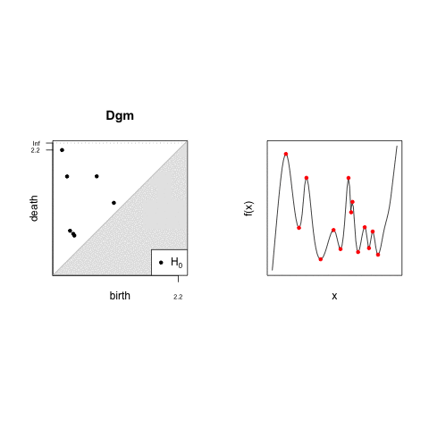

_Stable_ : $d_B(\mathrm{dgm}(f), \mathrm{dgm}(g)) \leq \lVert f - g \rVert_\infty$ between function $f,g$[3]

--- -->

# Persistent Homology is an _intrinsic invariant_

- Persistent Homology (PH) is a well-established tool in the sciences[1,2]
  
- PH has many attractive properties beyond homology:
  

1. _General_ : Persistence can be generalized _via rank functions_ [5,6]
2. _Descriptive_ : $d_{B}(\mathrm{dgm}_p(X), \mathrm{dgm}_p(Y))$ lower-bounds $d_{GH}(X, Y)$[7]
3. _Geometric_ :  distributed $\mathrm{dgm}$'s interpolate local geometry $\leftrightarrow$ global topology[4]
4. _Stable_ : $d_B(\mathrm{dgm}(f), \mathrm{dgm}(g)) \leq \lVert f - g \rVert_\infty$ between function $f,g$[3]

_Collections_ of $\mathrm{dgm}$'s <u>uniquely</u> characterize simplicial complexes in $\mathbb{R}^d$[7]

$$
\fbox{
  { \large $\mathrm{PH}$ is more then just a homology inference tool! }
}
$$

<footer class="fixed float-bottom bottom-0 whitespace-nowrap " style="font-size: 0.60rem; line-height: 0.65rem;text-align: center;"> 

1. Wigner, Eugene P. "The unreasonable effectiveness of mathematics in the natural sciences." Mathematics and Science. 1990. 291-306.

2. Turkeš, Renata, Guido Montúfar, and Nina Otter. "On the effectiveness of persistent homology." arXiv preprint arXiv:2206.10551 (2022). 
  
3. Cohen-Steiner, David, Herbert Edelsbrunner, and John Harer. "Stability of persistence diagrams." Discrete & computational geometry 37.1 (2007): 103-120.
  
4. Solomon, Elchanan, Alexander Wagner, and Paul Bendich. "From geometry to topology: Inverse theorems for distributed persistence." arXiv preprint arXiv:2101.12288 (2021).
  
5. Zomorodian, Afra, and Gunnar Carlsson. "Computing persistent homology." Discrete & Computational Geometry 33.2 (2005): 249-274.

6. Bergomi, Mattia G., and Pietro Vertechi. "Rank-based persistence." arXiv preprint arXiv:1905.09151 (2019).
  
7. Turner, Katharine, Sayan Mukherjee, and Doug M. Boyer. "Persistent homology transform for modeling shapes and surfaces." Information and Inference: A Journal of the IMA 3.4 (2014): 310-344.

   

</footer> 

---

# Persistent Homology is a intrinsic _difficult invariant_

The persistence computation scales $\sim O(m^3)$ over $K$ with $m = \lvert K \rvert$ simplices

Morozov gave an counter-example[1] showing this bound to be tight (i.e. $\Omega(m^3)$)

$$ \implies \text{computing } \mathrm{dgm}_p(K) \sim \Theta(m^3) = \Theta(n^{3(p+2)}) \text{ over an } n \text{-point set,} \text{ for } p \geq 1$$

_Simple algorithm_ $\neq$ _simple implementation_ 

1. Computing $R = \partial V$ is _memory intensive_: $\lvert V \rvert \sim O(m^2)$
2. $K$'s structure affects complexity (e.g. 2-manifolds $\sim O(n \alpha(n))$[2])
3. Theory is extensive: _clearing_[3], _apparent pairs_[4], _cohomology_[5], ...
4. $\mathbb{F}$ matters: $\mathbb{Z}_2$ columns $\leftrightarrow$ 64-arity bit-trees + DeBruijin "magic" tables[6]

<footer class="fixed float-bottom bottom-0 whitespace-nowrap" style="font-size: 0.60rem; line-height: 0.65rem;"> 

1. Morozov, Dmitriy. "Persistence algorithm takes cubic time in worst case." BioGeometry News, Dept. Comput. Sci., Duke Univ 2 (2005).

2. Dey, Tamal Krishna, and Yusu Wang. Computational topology for data analysis. Cambridge University Press, 2022.
  
3. Chen, Chao, and Michael Kerber. "Persistent homology computation with a twist." Proceedings 27th European workshop on computational geometry. Vol. 11. 2011.

4. Bauer, Ulrich. "Ripser: efficient computation of Vietoris–Rips persistence barcodes." Journal of Applied and Computational Topology 5.3 (2021): 391-423.

5. De Silva, Vin, Dmitriy Morozov, and Mikael Vejdemo-Johansson. "Dualities in persistent (co) homology." Inverse Problems 27.12 (2011): 124003.

6. See PHAT's source: https://github.com/blazs/phat/blob/master/include/phat/representations/bit_tree_pivot_column.h
  

</footer>

---

# This Talk: Persistent Betti numbers _over time_ 

<!-- The persistent Betti number is a "weaker" invariant than persistent homology 

$$ \beta_p^{i,j}: K_\bullet \to \mathbb{Z}_{+} = \mathrm{dim}(H_p(K_i) \to H_p(K_j)) $$ -->

<!-- The persistence diagram is _defined_ by it's persistent Betti numbers -->
The persistence $\mathrm{dgm}$ of function $f$ is _defined_ by persistent Betti numbers (PBNs)
$$ \mathrm{dgm}_p(f) \subset \overline{\mathbb{R}}^2 \Leftrightarrow (i,j) \text{ such that } \mu_p^{i,j} \neq 0$$
<!-- 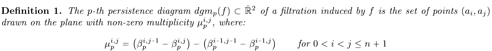 -->
where $\mu_p^{i,j}$ is called the _multiplicity function_, defined as: 

$$\mu_p^{i,j} = (\beta_p^{i,j\text{-}1} - \beta_p^{i,j}) - (\beta_p^{i\text{-}1,j\text{-}1} - \beta_p^{i\text{-}1,j})$$

<!-- Thus, time-varying extensions to $\beta_{p}^{i,j}$ $\approx$ properties $\mathrm{dgm}_p$ over time -->

$\beta_p: K_\bullet \times \mathbb{R} \to \mathbb{Z}_{+}$&nbsp;&nbsp;

$\beta_p: \mathcal{P}(X) \times \mathbb{R} \times \mathbb{R} \to \mathbb{Z}_{+}$&nbsp;&nbsp;

$\beta_p^{i,j}: \mathcal{P}(X) \times \mathbb{R} \to \mathbb{Z}_{+}$&nbsp;&nbsp;

$\Longrightarrow$

$\Longrightarrow$

$\Longrightarrow$

_Betti curve_ over filtration

_Betti curve_<u>_s_</u> over 1-parameter family

_Persistent Betti curves_ for _fixed_ $i,j \in I$

 

This talk will focus on relaxing $\beta_p^{i,j}$ for <i style="color: orange;"> time-varying settings </i>

<!-- _Betti curves_ are integer-valued functions over a fixed filtration + index set $I$ (say $\mathbb{R}$)
 -->

---

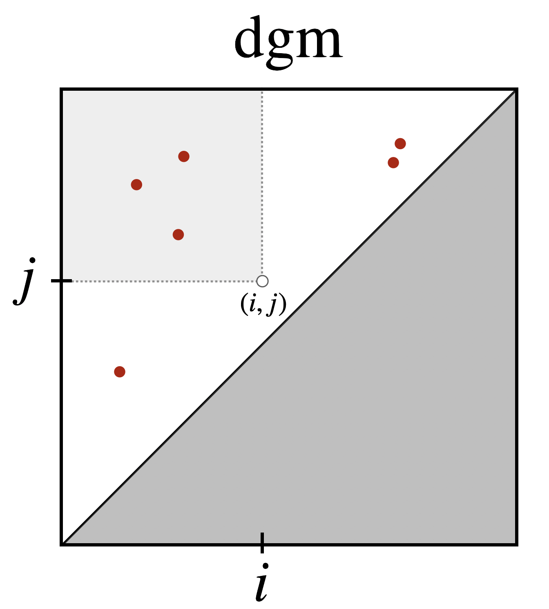

$$\beta_p^{i,j} = \mathrm{dim}(H_p(K_i) \to H_p(K_j))$$ 

---

# Outline 

 

$\large \rightarrow$ <u>Background</u> $\large \leftarrow$
&nbsp;&nbsp;&nbsp;&nbsp;&nbsp;Simplicial Complexes
&nbsp;&nbsp;&nbsp;&nbsp;&nbsp;Cyle, Boundary, and Chain Groups
&nbsp;&nbsp;&nbsp;&nbsp;&nbsp;Filtrations and Persistent Homology
The Main Result
&nbsp;&nbsp;&nbsp;&nbsp;&nbsp;$\beta_p^{i,j}$'s definition + computation
&nbsp;&nbsp;&nbsp;&nbsp;&nbsp;A clever observation + trick
&nbsp;&nbsp;&nbsp;&nbsp;&nbsp;Re-thinking chains and ranks w/ coefficients in $\mathbb{R}$
&nbsp;&nbsp;&nbsp;&nbsp;&nbsp;Relaxation: definition and properties
Applications
&nbsp;&nbsp;&nbsp;&nbsp;&nbsp;A $(1-\epsilon)$-approximation of $\beta_{p}^{i,j}$
&nbsp;&nbsp;&nbsp;&nbsp;&nbsp;Signatures of time-varying systems
&nbsp;&nbsp;&nbsp;&nbsp;&nbsp;Leveraging PHT theory

 

---
# Background: Simplicial Complexes

A _simplicial complex_ $K = \{\sigma : \sigma \in \mathcal{P}(V)\}$ over set $V = \{v_1, \dots, v_n\}$ satisfies: 

$$ \text{(vertex)} \quad v \in V \Longrightarrow \{v\} \in K $$
$$ \text{(face)  }  \quad \tau \subseteq \sigma \in K \Longrightarrow \tau \in K $$

<!-- 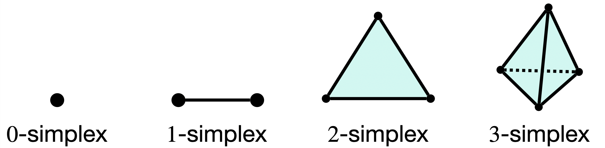 -->

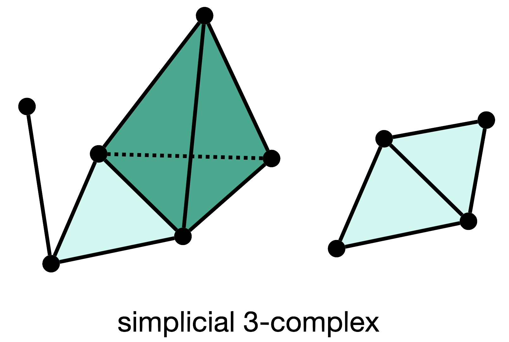

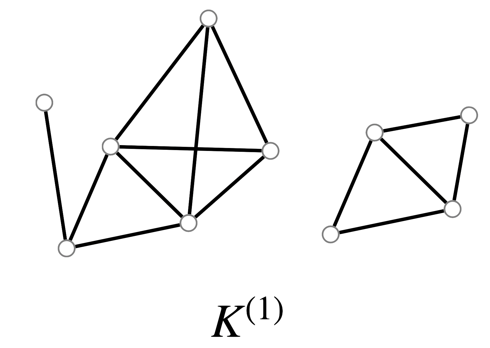

  

All computations here will be with _finite simplicial complexes_

---

# Background: Boundaries 

Given an _oriented_ $p$-simplex $\sigma \in K$, define its $p$-boundary as the alternating sum:

$$ \partial_p(\sigma) = \partial_p([v_0, v_1, \dots, v_p]) = \sum_{i=0}^p (-1)^i [v_0, \dots, \hat{v}_i, \dots v_p] $$

We will make heavy use of _oriented boundary matrices_

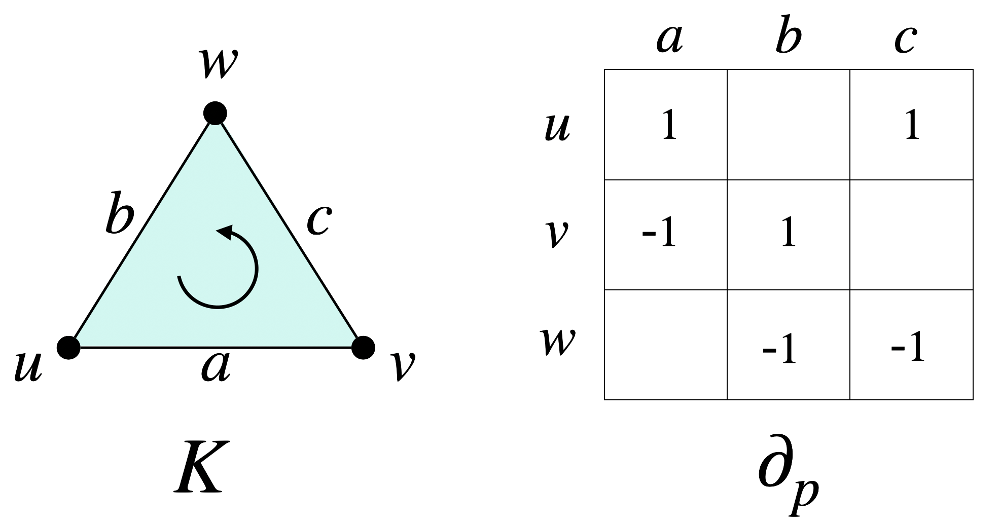

By default, we will work generically with the simplex-wise lexicographical order

---

# Background: The Groups  

Given a pair $(\, K, \, \mathbb{F} \, )$, a $p$-chain is a formal $\mathbb{F}$-linear combination of $p$-simplices of $K$ 

The operator $\partial_p$ extends linearly to $p$-chains via their constitutive simplices 

$$ c = \sum_{i=1}^{m_p} \alpha_i \sigma_i , \quad\quad\quad  c + c' = \sum_{i=1}^{m_p} (\alpha_i + \alpha_i') \sigma_i $$

Given $\mathbb{F}$ a field and $K$ a simplicial complex, the following groups are defined[1]

&nbsp; $C_p(K) = (\, K \, , \, + \, , \, \times \,, \, \mathbb{F} \,)$ 

&nbsp; $B_p(K) = (\mathrm{Im} \circ \partial_{p+1})(K)$ 

&nbsp; $Z_p(K) = (\mathrm{Ker} \circ \partial_{p})(K)$ 

&nbsp; $H_p(K) = Z_p(K) / B_{p}(K)$

&nbsp; &nbsp; $\Longleftrightarrow$

&nbsp; &nbsp; $\Longleftrightarrow$

&nbsp; &nbsp; $\Longleftrightarrow$

&nbsp; &nbsp; $\Longleftrightarrow$

_vector space_ of $p$-chains

_boundary group_

_cycle group_

_homology group_

<!-- _footer: Munkres, James R. Elements of algebraic topology. CRC press, 2018. -->

---
<!-- 
# Homology 

The $p$-th homology of $K$ is the quotient group $H_p(K) = Z_p(K) / B_{p}(K)$

$\beta_p = \mathrm{dim}(H_p(K)) \leftrightarrow$ the dimension of the $p$-th homology group

<!-- Note: $H_p(K)$ depends on the choice of $\mathbb{F}$ ! -->

# Background: Filtrations

A _filtration_ $K_\bullet$ is a family $\{ \, K_i \, \}_{i\in I}$  indexed over a totally ordered index set $I$:

*Filtered* 

*Essential* 

*Simplexwise*

&nbsp;&nbsp; $\Longleftrightarrow$

&nbsp;&nbsp; $\Longleftrightarrow$

&nbsp;&nbsp; $\Longleftrightarrow$

 

$K_0 \subsetneq K_1 \subsetneq \dots \subsetneq K_m = K_\bullet$

$i \neq j$ implies $K_i \neq K_j$

$K_j \smallsetminus K_i = \{\sigma_j\}$ when $j = \mathrm{succ}(i)$

 

Any $K_\bullet \mapsto$ essential & simplexwise via _condensing_ + _refining_ + _reindexing maps_ [1]

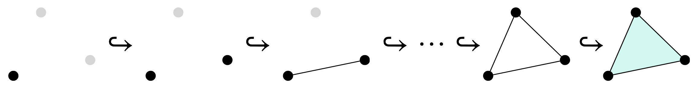

Note here that $I$ may be $\mathbb{R}_+$ or $[m] = \{\, 1, 2, \dots, m\, \}$, depending on the context!

<!-- _footer: Bauer, Ulrich. "Ripser: efficient computation of Vietoris–Rips persistence barcodes." Journal of Applied and Computational Topology 5.3 (2021): 391-423. -->

---

# Background: Persistent Homology 

Inclusions $K_i \hookrightarrow K_j$ induce linear transformations $h_p^{i,j}$ between homology groups 

$$ H_p(K_0) \to \dots \to H_p(K_i) \underbrace{\to \dots \to}_{h_p^{i,j}} H_p(K_j) \to \dots \to H_p(K_m) = H_p(K_\bullet) $$

Properties of persistent homology groups:

&nbsp;&nbsp;   1. $H_p(K_\bullet)$ admits a _pair decomposition_ $\mathrm{dgm}(K) \subseteq \bar{\mathbb{R}}^2$
&nbsp;&nbsp;   2. $\mathrm{dgm}(K)$ is _unique_ iff $\mathbb{F}$ is a field
&nbsp;&nbsp;   3. $\beta_p^{i,j}$ can be read-off directly for any $i,j$ from $\mathrm{dgm}_p(K)$
&nbsp;&nbsp;   4. Computed via matrix decomposition $R = \partial V$

 

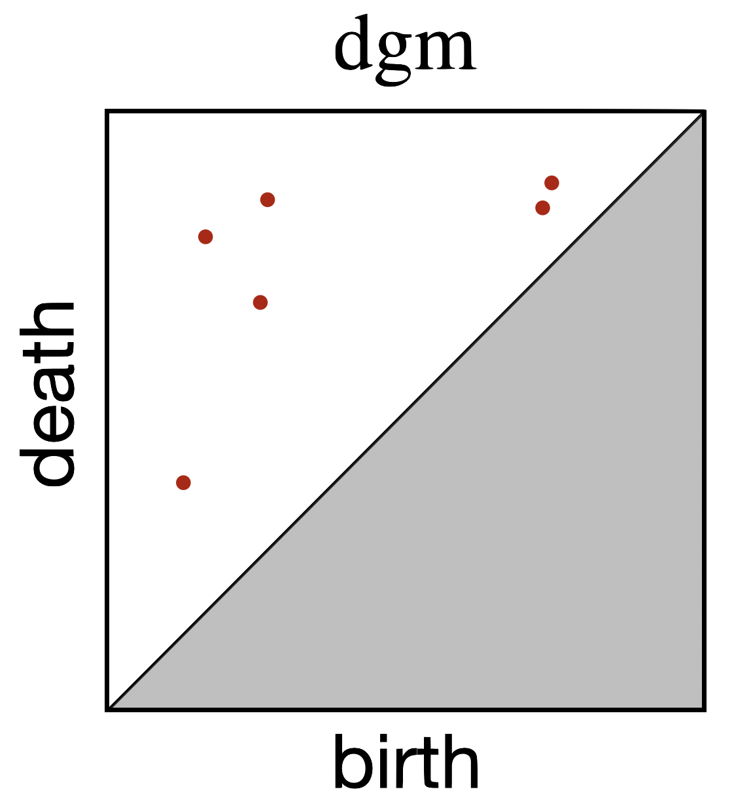

  

For simplicity, we will use $\partial_p^i = \partial_p(K_i)$, $Z_p^i = Z_p(K^i)$, $B_p^i = B_p(K^i)$, etc.

<!-- 3. $(\sigma_i, \sigma_j)$ = birth/death pair, $\lvert i - j \rvert$ = persistence of the pair  -->
<!-- Computation: 
  1. Collect the boundary chains of $K$ into a $m \times m$ matrix $\partial$
  2. Compute a specific decomposition $R = \partial V$ using left-to-right column operations -->
<!-- https://iuricichf.github.io/ICT/index.html -->

---

# Outline 

 

Background 
&nbsp;&nbsp;&nbsp;&nbsp;&nbsp;Simplicial Complexes
&nbsp;&nbsp;&nbsp;&nbsp;&nbsp;Cyle, Boundary, and Chain Groups
&nbsp;&nbsp;&nbsp;&nbsp;&nbsp;Filtrations and Persistent Homology
$\large \rightarrow$ <u>The Main Result</u> $\large \leftarrow$
&nbsp;&nbsp;&nbsp;&nbsp;&nbsp;$\beta_p^{i,j}$'s definition + computation
&nbsp;&nbsp;&nbsp;&nbsp;&nbsp;A clever observation + trick
&nbsp;&nbsp;&nbsp;&nbsp;&nbsp;Re-thinking chains and ranks w/ coefficients in $\mathbb{R}$
&nbsp;&nbsp;&nbsp;&nbsp;&nbsp;Relaxation: definition and properties
Applications
&nbsp;&nbsp;&nbsp;&nbsp;&nbsp;A $(1-\epsilon)$-approximation of $\beta_{p}^{i,j}$
&nbsp;&nbsp;&nbsp;&nbsp;&nbsp;Signatures of time-varying systems
&nbsp;&nbsp;&nbsp;&nbsp;&nbsp;Leveraging PHT theory

 

---

# $\beta_p^{i,j}$: starting with the definition

Before extending $\beta_p^{i,j}$ to the time-varying setting, first consider its definition:

<!--    -->

$$
\begin{align*}
	\beta_p^{i,j} &= \mathrm{dim}(H_p(K_i) \to H_p(K_j)) \\
  &= \mathrm{dim} \left( Z_p(K_i) \, / \, B_p(K_j) \right) \\
	&= \mathrm{dim} \left( Z_p(K_i) \, / \, ( Z_p(K_i) \cap B_p(K_j)) \right) \\
	&= \mathrm{dim} \left( Z_p(K_i) \right) - \mathrm{dim}\left( Z_p(K_i) \cap B_p(K_j) \right ) \\
  &= \mathrm{dim} \left( C_p(K_i) \right) - \mathrm{dim} \left( B_{p-1}(K_i) \right) - \mathrm{dim}\left( Z_p(K_i) \cap B_p(K_j) \right )
  % &= \lvert K_i \rvert - \mathrm{rank}(\partial_p(K_i)) - \mathrm{rank}(`` \; \partial_p^{i,j} \; ")
\end{align*}
$$
<!-- $$ \beta_p^{i,j} = \mathrm{dim} \left( C_p(K_i) \right) - \mathrm{dim} \left( B_{p-1}(K_i) \right) - \mathrm{dim}\left( Z_p(K_i) \cap B_p(K_j) \right )   $$ -->
<!-- where $(1)$ is due to $Z_p(K_i) \leq B_p(K_j)$, $(2)$ follows by def. of quotient a space, and $(3)$ by rank-nullity -->

Replacing the groups above with appropriate matrices / constants, we have: 

$$ \beta_p^{i,j} = \lvert K_i^{(p)} \rvert  - \mathrm{rank}(\partial_p^i) - \mathrm{rank}(\partial_p^{i,j})$$

where $\partial_p^{i,j}$ is <i style="color: orange;">some matrix</i> whose columns span $Z_p(K_i) \cap B_p(K_j)$...

---

# Computing the _persistent_ Betti number $\beta_p^{i,j}$

  

$$
\fbox{
  $\beta_p^{i,j} = \underbrace{\mathrm{dim} \left( C_p(K_i) \right)}_{(1)} - \underbrace{\mathrm{dim} \left( B_{p-1}(K_i) \right)}_{(2)} - \underbrace{\mathrm{dim}\left( Z_p(K_i) \cap B_p(K_j) \right )}_{(3)}$
}
$$

<!-- $(1)$ is # of $p$-simplices in $K_i$ and $(2)$ is given by $\mathrm{rank}( \partial_p(K_i))$ -->
Both $(1)$ are $(2)$ easy to obtain. Computing $(3)$ is more subtle:

   <!-- a. Use PH / reduction algorithm: $\sum_{k=1}^j \textbf{1}(\mathrm{low}_{R_{p+1}}[k] \leq i)$
   b. Use Gaussian elimination to find basis[1]
   c. Use Anderson-Duffin formula[2]: $P_{\mathbf{Z} \cap \mathbf{B}} = 2 P_{\mathbf{Z}}(P_{\mathbf{Z}} + P_{\mathbf{B}})^\dagger P_{\mathbf{B}}$
   d. Use Von-Neumann's theorem[3]: $P_{\mathbf{Z} \cap \mathbf{B}} = \lim\limits_{n\to \infty}\left( P_\mathbf{Z} P_\mathbf{B}\right)^n$
    -->

&nbsp;&nbsp; PH / reduction algorithm

&nbsp;&nbsp; Gaussian elimination[1]

&nbsp;&nbsp; Anderson-Duffin formula[2]

<!-- &nbsp;&nbsp; Von-Neumann's theorem[3] -->

$\implies$

$\implies$

$\implies$

<!-- $\implies$ -->

&nbsp;  $\sum_{k=1}^j \textbf{1}(\mathrm{low}_{R_{p+1}}[k] \leq i)$

&nbsp; ( see Zomorodian & Carlsson [1] )

&nbsp; $P_{\mathbf{Z} \cap \mathbf{B}} = 2 P_{\mathbf{Z}}(P_{\mathbf{Z}} + P_{\mathbf{B}})^\dagger P_{\mathbf{B}}$

<!-- &nbsp; $P_{\mathbf{Z} \cap \mathbf{B}} = \lim\limits_{n\to \infty}\left( P_\mathbf{Z} P_\mathbf{B}\right)^n$ -->

Alternative: $\beta_p^{i,j} = \mathrm{null}(\Delta_p^{i,j})$ where $\Delta_p^{i,j}$ is the _persistent Laplacian_ [4] 

_All of these rely on <u>explicit reductions</u> or <u>expensive projectors</u>. Not great!_

<footer class="fixed float-bottom bottom-0 whitespace-nowrap" style="font-size: 0.60rem; line-height: 0.65rem;"> 

1. Zomorodian, Afra, and Gunnar Carlsson. "Computing persistent homology." Discrete & Computational Geometry 33.2 (2005): 249-274. 
  
2. Ben-Israel, A., and A. Charnes. "On the intersections of cones and subspaces." Bulletin of the American Mathematical Society 74.3 (1968): 541-544.
  
3. Neumann, J. Von. "Functional Operators, Vol. II. The Geometry of Orthogonal Spaces. Annals of Math." Studies Nr. 22 Princeton Univ. Press (1950).
  
4. Mémoli, Facundo, Zhengchao Wan, and Yusu Wang. "Persistent Laplacians: Properties, algorithms and implications." SIAM Journal on Mathematics of Data Science 4.2 (2022): 858-884.
  

</footer>

---

# A clever observation

<!-- Given $A \in \mathcal{M}_{(m \times m)}(\mathbb{R})$, let $A^{i,j}$, $A^{\bar{i},j}$ denote the following submatrices of $A$: -->
Let $R = \partial V$, where $V$ is full-rank. Define the sub-matrices $R^{i,j}$, $R^{\bar{i},j}, \partial^{i,j}$, $\partial^{\bar{i},j}$ as: 

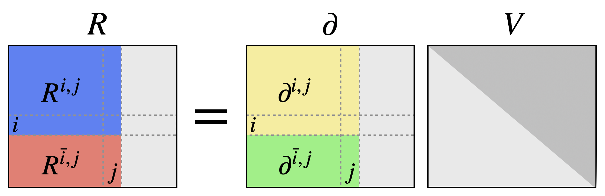

  

The Pairing Uniqueness Lemma[2] can be used to show, for any $1 \leq i < j < m$, that:

$$ \fbox{ 
  $\mathrm{low}_R[j] = i \iff \mathrm{rank}(R^{\overline{i},j}) = \mathrm{rank}(\partial^{\overline{i}, j}) $
}$$
<!-- 

 

where $\small r_A(i,j)$ := $\small \mathrm{rank}(A^{\overline{i-1}, j}) - \mathrm{rank}(A^{\bar{i}, j}) + \mathrm{rank}(A^{\bar{i}, j-1}) - \mathrm{rank}(A^{\overline{i-1}, j-1})$

 -->

 

This was _the_ motivating exploit in the first output-sensitive PH algorithm[1,2] 

<footer class="fixed float-bottom bottom-0 whitespace-nowrap" style="font-size: 0.60rem; line-height: 0.65rem;"> 

1. Chen, Chao, and Michael Kerber. "An output-sensitive algorithm for persistent homology." Computational Geometry 46.4 (2013): 435-447.

2. Dey, Tamal Krishna, and Yusu Wang. Computational topology for data analysis. Cambridge University Press, 2022.
  

</footer>

---

# A clever trick

Pairing uniqueness[1] $\implies \mathrm{rank}(R^{\bar{i},j}) = \mathrm{rank}(\partial^{\bar{i}, j})$, for any $1 \leq i < j < m$

Dey & Wang show[2] have shown the following:
$$
\begin{align*}
  \mathrm{dim}(Z_p^i \cap B_p^j) &= \mathrm{dim}(B_p^j) - \#(\mathrm{col}_{R_{p+1}}[k] \neq 0 \mid k \in [j], \; \mathrm{low}_{R_{p+1}}[k] > i) \\
  &= \mathrm{rank}(R_{p+1}^{j,j}) - \mathrm{rank}(R_{p+1}^{\overline{i},j}) \\
  &= \mathrm{rank}(\partial_{p+1}^{j,j}) - \mathrm{rank}(\partial_{p+1}^{\overline{i},j})
\end{align*}
$$
Let $I_p^{i}$ be the diagonal matrix with whose first $i$ entries are $1$. We can now write: 
$$ \beta_p^{i,j} = \mathrm{rank}(\mathrm{I}_p^i) - \mathrm{rank}(\partial_{p}^{i,i}) - \mathrm{rank}(\partial_{p+1}^{j,j}) + \mathrm{rank}(\partial_{p+1}^{\overline{i},j})$$
Thus, we may write $\beta_p^{i,j}$ completely in terms of <i style="color: orange;">unfactored matrices</i>

<footer class="fixed float-bottom bottom-0 whitespace-nowrap" style="font-size: 0.60rem; line-height: 0.65rem;"> 

1. Edelsbrunner, Herbert, and John L. Harer. Computational topology: an introduction. American Mathematical Society, 2022.

2. Dey, Tamal Krishna, and Yusu Wang. Computational topology for data analysis. Cambridge University Press, 2022.

</footer>

---

# Parameterizing elementary $p$-chains 

Suppose we fix $\mathbb{F} = \mathbb{R}$ and replace chain values with _smoothstep_ functions $S_\epsilon(x)$

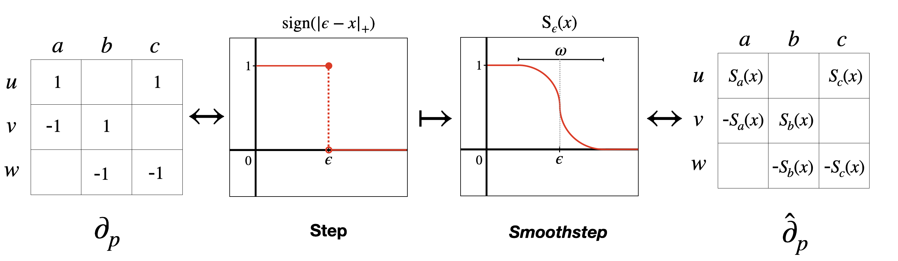

$$\hat{\partial}_p[i,j] = \pm (S_{\epsilon_j} \circ f )(\sigma_j) \quad \text{if } \sigma_i \in \partial(\sigma_j), \quad \text{where } \epsilon_j = f(\sigma_j)$$

Advantage: If $f$ varies continuous one-parameter family, $\hat{\partial}_p$ also varies continuously 

---

# A generic approximation of rank

Moreover, replace $\mathrm{rank}(A)$ with $\Phi_\epsilon(A)$, defined for some fixed $\epsilon > 0$ as:

$$ \Phi_\epsilon(A) = \sum\limits_{i}^{n} \frac{\sigma_i^2}{\sigma_i^2 + \epsilon}, \quad \text{where }\sigma_i^2 := \lambda_i(A A^T)$$

Observe $\Phi_\epsilon(A) \leq \mathrm{rank}(A)$, with equality when $\epsilon = 0$

---

In summary: 

- $\beta_p^{i,j} \mapsto$ $\pm \, \mathrm{rank}(\partial_p^{\ast})^\ast$ 
- $\partial \mapsto \hat{\partial}$
- $\mathrm{rank}(\cdot) \mapsto \Phi_\epsilon(\cdot)$

$$ \fbox{ 
  $\large \hat{\beta}_p^{i,j} = \Phi_\epsilon(\mathrm{I}_p^i) - \Phi_\epsilon(\hat{\partial}_{p}^{i,i}) - \Phi_\epsilon(\hat{\partial}_{p+1}^{j,j}) + \Phi_\epsilon(\hat{\partial}_{p+1}^{\overline{i},j})$
}
$$
Interpretation: spectrum of $\hat{\partial}_p^{\ast}$ encodes geometric information from $f$

--- 

<!-- 

__Ex__: Let $\delta_X = (X, d_X(\cdot))$, $d_X : X \times X \times \mathbb{R}$ be a _dynamic metric space_, and let:
$$ \hat{\beta}_p^{i,j}(t) = \left(\mathrm{dim} \circ \mathrm{H}_p^{i,j} \circ \mathrm{Rips} \circ \delta_\mathcal{X} \right)(t)$$ 
Observe that $\hat{\beta}_p^{i,j}(t) \in \mathbb{R}$ varies _continuously_ with $t$&mdash;a time-varying relaxation!

 -->

---

# Basic properties of $\hat{\beta}_p^{i,j}$
<!-- We now show some properties of relaxing $\beta_p^{i,j} \mapsto \hat{\beta}_p^{i,j}$
$$
\fbox{$\hat{\beta}_p^{i,j} = \Phi_\epsilon(\mathrm{I}_p^i) - \Phi_\epsilon(\hat{\partial}_{p}^{i,i}) - \Phi_\epsilon(\hat{\partial}_{p+1}^{j,j}) + \Phi_\epsilon(\hat{\partial}_{p+1}^{\overline{i},j})$
}
$$ -->

Observe $\Phi_\epsilon(A) = \sum_{i=1}^n \sigma_i^2 / (\sigma_i^2 + \epsilon) \leq \mathrm{rank}(A)$, with equality obtained when $\epsilon = 0$

   1. $\hat{\beta}_p^{i,j} \to \beta_p^{i,j} \quad \text{ as } \quad \epsilon \to 0, \, \omega \to 0$
   2. There $\exists$ an $\epsilon^\ast > 0$ such that $\lceil \hat{\beta}_p^{i,j} \rceil = \beta_p^{i,j}$ for all $\epsilon \in (0, \epsilon^\ast]$ 

$\hat{\beta}_p^{i,j}$ respects several of $\beta_p^{i,j}$ monotonicity properties <i style="color: orange;">approximately</i>

$\forall \; i < k, \,  \beta_p^{i,j} \leq \beta_p^{k,j} \implies$

$\forall \; j < l, \, \beta_p^{i,j} \geq \beta_p^{i,l} \implies$

$\hat{\beta}_p^{i,j} + \delta_\epsilon(k-i) \leq \hat{\beta}_p^{k,j}$

$\hat{\beta}_p^{i,j} + \delta_\epsilon(l - j) \leq \hat{\beta}_p^{i,l}$

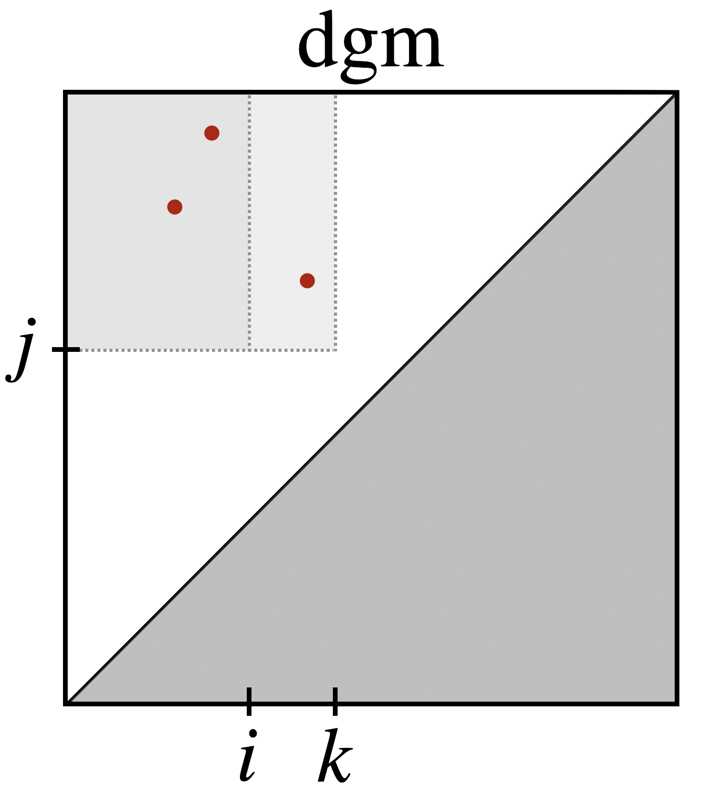 </img>

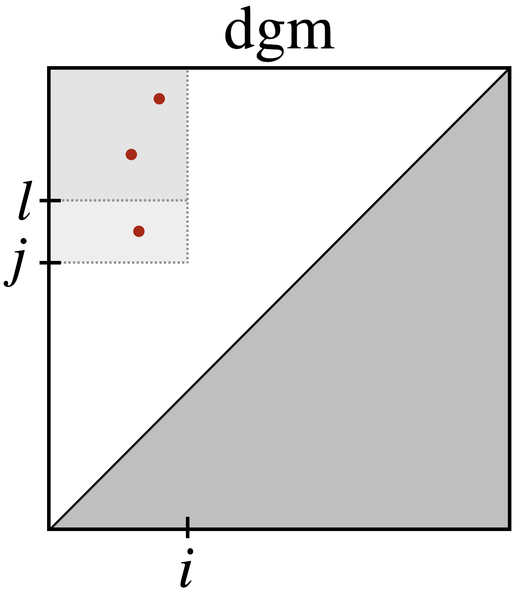 </img>

$\hat{\beta}_p^{i,j}$ also satisfies and $\epsilon$-approximate version of _jump monotonicity_[1]

---

# Persistence measures

Pairs $(i,j)$ in $\mathrm{dgm}$'s can also be defined as limiting points w/ non-zero multiplicity

$$ \mu_p^{i,j} = \min_{\epsilon > 0} \left \{ \beta_p^{i+\epsilon, j - \epsilon}- \beta_p^{i-\epsilon, j - \epsilon}  - \beta_p^{i+\epsilon, j+\epsilon}  + \beta_p^{i-\epsilon, j + \epsilon} \right \} $$

PBN's also yield "counting measures" in $\overline{\mathbb{R}}^2$, due to their additivity under splitting:

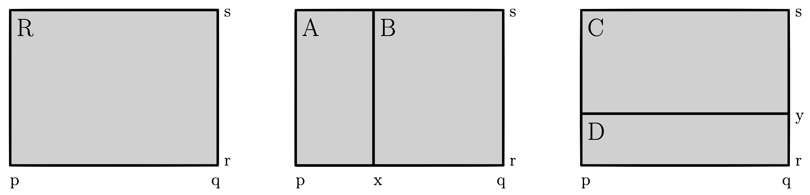

$$\mu(R) = \mu(A) + \mu(B) =  \mu(C) + \mu(D)$$

$\hat{\mu}_{\epsilon}$ also obeys inclusion/exclusion&mdash;can be interpreted as a <u> _persistence measure_ </u>

<!-- boundary replacement -->

---

# Outline 

 

Background 
&nbsp;&nbsp;&nbsp;&nbsp;&nbsp;Simplicial Complexes
&nbsp;&nbsp;&nbsp;&nbsp;&nbsp;Cyle, Boundary, and Chain Groups
&nbsp;&nbsp;&nbsp;&nbsp;&nbsp;Filtrations and Persistent Homology
The Main Result
&nbsp;&nbsp;&nbsp;&nbsp;&nbsp;$\beta_p^{i,j}$'s definition + computation
&nbsp;&nbsp;&nbsp;&nbsp;&nbsp;A clever observation + trick
&nbsp;&nbsp;&nbsp;&nbsp;&nbsp;Re-thinking chains and ranks w/ coefficients in $\mathbb{R}$
&nbsp;&nbsp;&nbsp;&nbsp;&nbsp;Relaxation: definition and properties
$\large \rightarrow$ <u>Applications</u> $\large \leftarrow$
&nbsp;&nbsp;&nbsp;&nbsp;&nbsp;A $(1-\epsilon)$-approximation of $\beta_{p}^{i,j}$
&nbsp;&nbsp;&nbsp;&nbsp;&nbsp;Signatures of time-varying systems
&nbsp;&nbsp;&nbsp;&nbsp;&nbsp;Leveraging PHT theory

 

---

# $(1 - \delta)$-approximation scheme for $\hat{\beta}_p^{i,j}$

<!-- Q: Can we approximate $\beta_p^{i,j}$ (over $\mathbb{R}$) by computing $\hat{\beta}_p^{i,j}$? -->

The fixed parameters $(\omega, \epsilon)$ completely determine the closeness of $\lvert \hat{\beta}_p^{i,j} - \beta_p^{i,j} \rvert$

The _Lanczos_ method[1,2] computes $q$-largest $\sigma^2(A)$ of a sparse $m \times m$ matrix $A$ in: 

$$ O(m \cdot T_m(A) + q^2 \cdot m ) $$

where $T_m(A)$ is complexity of $v \mapsto A v$ &nbsp;. Note $\partial_\ast$ is highly structured, namely: 
- $\mathrm{nnz}(\partial_p) \leq (p+1) m_p \sim O(m_p \log(m_p))$
- $v \mapsto \langle \partial_p, v \rangle$ takes $\sim O(\kappa_p)$ time where $\kappa_p = \sum \mathrm{deg}_p(\sigma_p)$
- $\Delta_p = \mathrm{tr}(\partial_p \partial_p^T) = \sum \sigma_i^2(\partial_p)$ can be determined in $O(m_p)$ time 

We deduce a $(1 - \delta)$-approximation by computing the $q$-largest $\sigma^2_i$'s such that: 

$$\big\lceil \Delta_p^{q}/\Delta_p^{m_p} \big\rceil \geq (1 - \delta)$$ 

<footer class="fixed float-bottom bottom-0 whitespace-nowrap" style="font-size: 0.60rem; line-height: 0.65rem; text-align: center;"> 

1. Golub, Gene H., and Charles F. Van Loan. Matrix computations. JHU press, 2013.
2. Trefethen, Lloyd N., and David Bau III. Numerical linear algebra. Vol. 50. Siam, 1997.

</footer>

---
# The Persistent Homology Transform 

The _PHT_ characterizes the set of embeddeable s.c.'s in $\mathbb{R}^d$ via a collection of $\mathrm{dgm}$'s

$$
\begin{aligned}
\operatorname{PHT}(M): S^{d-1} & \rightarrow \mathcal{D}^{d} \\
v & \mapsto\left(X_{0}(M, v), X_{1}(M, v), \ldots, X_{d-1}(M, v)\right)
\end{aligned} 
$$

where $\mathcal{D}^d$ is the space of $\mathrm{dgm}_p$'s up to dimension $p=d-1$

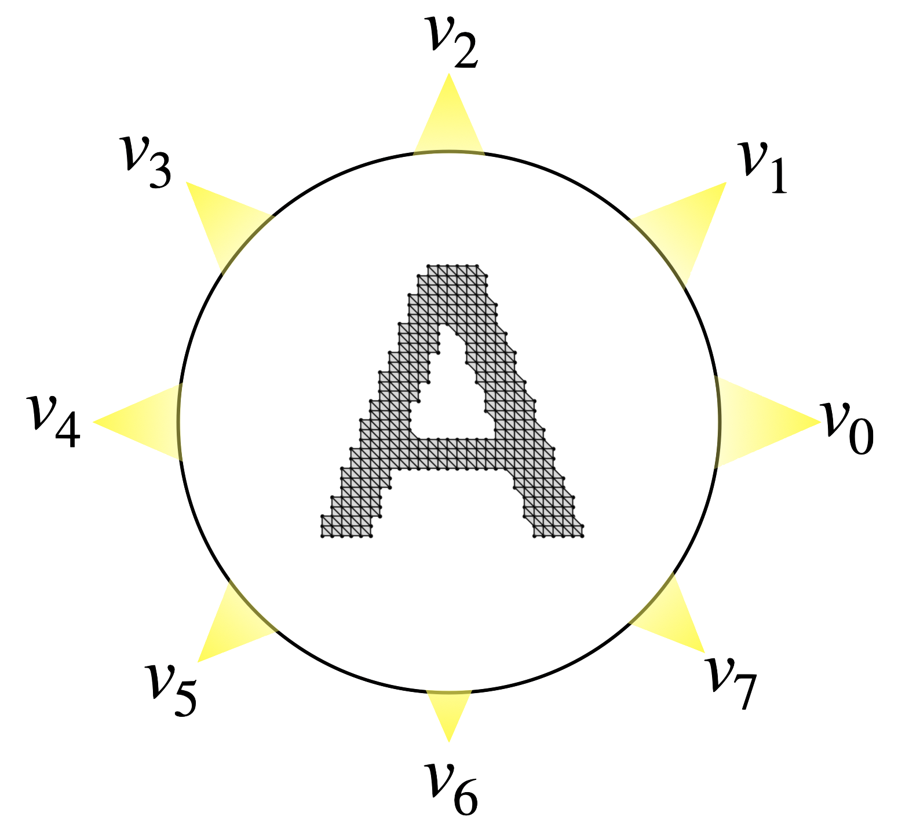

The PHT is _injective_ $\implies$ $\mathrm{dgm}$-distances (e.g. integrated $d_B$) are  _metrics_

The injectivity PHT theory allows for comparison of <i style="color: orange;">non-diffeomorphic</i> shapes

<footer class="fixed float-bottom bottom-0 whitespace-nowrap" style="font-size: 0.60rem; line-height: 0.65rem;"> 

1. Turner, Katharine, Sayan Mukherjee, and Doug M. Boyer. "Persistent homology transform for modeling shapes and surfaces." Information and Inference: A Journal of the IMA 3.4 (2014): 310-344. 

</footer>

---

# Applications: Leveraging PHT

 Pro:  PHT + it's associated distance metrics tend to do well at shape discrimination[1]

 Con:  Many $\mathrm{dgm}$'s + $\int d_B(\dots)$ are highly non-trivial to compute

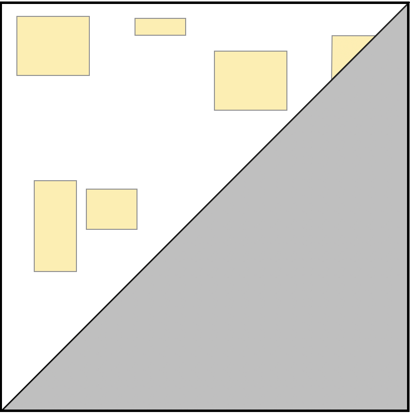

$$\Huge\mapsto$$

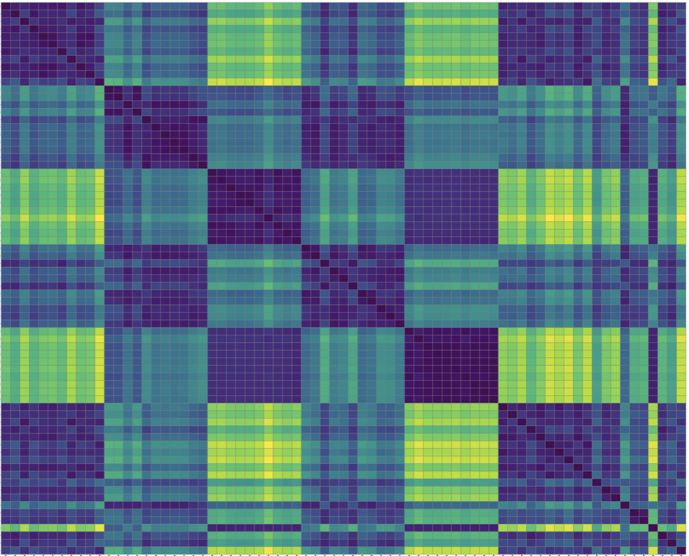

  

- (1) Choose a set rectangles $\mathcal{R} = \{r_1, r_2, \dots, r_k\}$ in $\mathbb{R}^2$ representing "features"
- (2) Compute multiplicities $\mathbf{u}_p(X) = \{ \hat{\mu}_p^\epsilon(r_1), \hat{\mu}_p^\epsilon(r_2), \dots, \hat{\mu}_p^\epsilon(r_k) \}$ for shapes $X$, $Y$
- (3) Define $\hat{d}_\mathcal{R}(X, Y) = \lVert \mathbf{u}_p(X) - \mathbf{u}_p(Y)\rVert$, up to an optimal rotation[1]

We hope to do have more comparisons in the future 

---

# Thank you 

---

<!-- $$
\def\arraystretch{1.5}
  \underset{\begin{array}{c|c:c:c|}
     & \phantom{}^{a}_{b} & \phantom{}^{a}_{c} & \phantom{}^{b}_{c} \\
    \hline
    a & {\footnotesize \phantom{+} c(\sigma) } & {\footnotesize \phantom{+} c(\sigma)} &   \\ \hdashline
    b & {\footnotesize -c(\sigma)}             &                                       &  {\footnotesize \phantom{+} c(\sigma)} \\ \hdashline
    c &                                        & {\footnotesize -c(\sigma)}            & {\footnotesize -c(\sigma)} \\ \hline
  \end{array}}{\huge \raisebox{0.25em}{\huge $A$}}
$$ -->

<!-- $$
\def\arraystretch{1.1}
\begin{array}{rcl} &
\begin{array}{ccc} \phantom{aa} a\ & \phantom{aa} b\ & \phantom{aa} c\ & \phantom{aa} \end{array} \\ 
\color{black}\begin{matrix}u\\v\\w\end{matrix}\hspace{-1.0em} & 
\begin{bmatrix}
{\footnotesize \phantom{+}c(\sigma)} & {\footnotesize \phantom{+}c(\sigma)}  &                                       &  \\
{\footnotesize -c(\sigma)}           &                                       &  {\footnotesize \phantom{+}c(\sigma)} &  \\
                                     & {\footnotesize -c(\sigma)}            &  {\footnotesize -c(\sigma)}           &  
\end{bmatrix}
\end{array}
$$ -->

---

# Properties of the rank function

The _rank_ of a linear map $\Phi$ is given as the dimension of its image: 
$$ \mathrm{r}(\Phi) = \mathrm{rank}(\Phi) = \mathrm{dim}(\mathrm{Im}(\Phi)) $$ 

When $A, B \in \mathcal{M}_{(n \times n)}(\mathbb{R})$,  the _rank function_ has many convenient properties:

*rank-nullity* 

*subadditive* 

*transposition invariance* 

*orthogonal invariance*

*permutation invariance*

&nbsp;&nbsp; $\Longleftrightarrow$

&nbsp;&nbsp; $\Longleftrightarrow$

&nbsp;&nbsp; $\Longleftrightarrow$

&nbsp;&nbsp; $\Longleftrightarrow$

&nbsp;&nbsp; $\Longleftrightarrow$

 

&nbsp; $\mathrm{r}(A) = \lvert A \rvert - \mathrm{null}(A)$

&nbsp; $\mathrm{r}(A + B) \leq \mathrm{r}(A) + \mathrm{r}(B)$

&nbsp; $\mathrm{r}(A) = \mathrm{r}(A^T) = \mathrm{r}(A^T A) = \mathrm{r}(A A^T)$

&nbsp; $\mathrm{r}(A) = \mathrm{r}(QA) = \mathrm{r}(AQ^T)$ &nbsp;&nbsp; $\big(Q$ := orthogonal $\big)$

&nbsp; $\mathrm{r}(A) = \mathrm{r}(P^{-1}A P)$  &nbsp;&nbsp; $\big(P$ := permutation matrix $\big)$

Let's see if we can apply some of these. 

---

 
