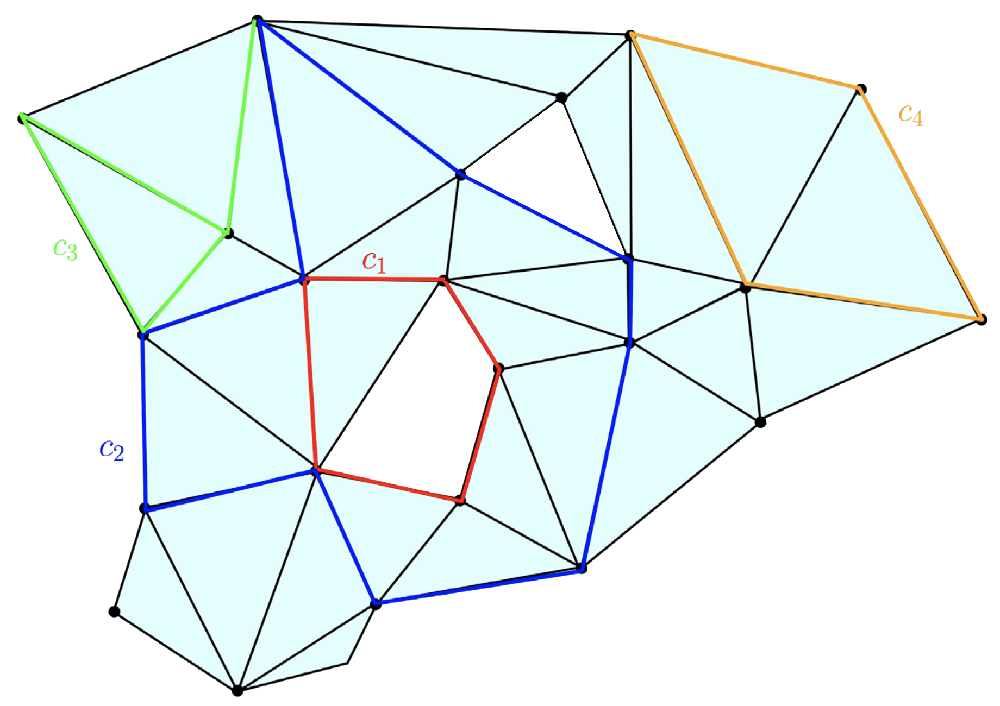

<!-- marp pbsig.md --html --allow-local-files -w -->

<!-- Global style -->

## Persistent Betti Numbers *over time*
### Theory, computation, and applications

---

# Preliminaries

A _simplicial complex_ $K = \{\sigma : \sigma \in \mathcal{P}(V)\}$ over set $V = \{v_1, \dots, v_n\}$ satisfies: 

$$ \text{(vertex)  } v \in V \Longrightarrow \{v\} \in K, \quad\quad \textcolor{blue}{\text{(face)}}\quad \tau \subseteq \sigma \in K \Longrightarrow \tau \in K $$

 

A _filtration_ $K_\bullet$ is a family $\{ \, K_i \, \}_{i\in I}$  indexed over a totally ordered index set $I$:

*Filtered* 

*Essential* 

*Simplexwise*
   

&nbsp;&nbsp; $\Longleftrightarrow$

&nbsp;&nbsp; $\Longleftrightarrow$

&nbsp;&nbsp; $\Longleftrightarrow$

 

$K_0 \subsetneq K_1 \subsetneq \dots \subsetneq K_m = K_\bullet$

$i \neq j$ implies $K_i \neq K_j$

$K_j \smallsetminus K_i = \{\sigma_j\}$ when $j = \mathrm{succ}(i)$

 

Any $K_\bullet \mapsto$ essential & simplexwise via _condensing_ + _refining_ + _reindexing maps_ [1]

 

Note here that $I$ may be $\mathbb{R}_+$ or $[m] = \{\, 1, 2, \dots, m\, \}$, depending on the context!

<!-- _footer: Bauer, Ulrich. "Ripser: efficient computation of Vietoris–Rips persistence barcodes." Journal of Applied and Computational Topology 5.3 (2021): 391-423. -->

--- 

# The Three Groups  

Given a pair $(\, K, \, \mathbb{F} \, )$, a $p$-chain is a formal $\mathbb{F}$-linear combination of $p$-simplices of $K$ 

Given an _oriented_ $p$-simplex $\sigma \in K$, define its $p$-boundary as the alternating sum:

$$ \partial_p(\sigma) = \partial_p([v_0, v_1, \dots, v_p]) = \sum_{i=0}^p (-1)^i [v_0, \dots, \hat{v}_i, \dots v_p] $$

The operator $\partial_p$ extends linearly to $p$-chains via their constitutive simplices 

&nbsp; $C_p(K) = (\, K \, , \, + \, , \, \times \,, \, \mathbb{F} \,)$ 

&nbsp; $B_p(K) = (\mathrm{Im} \circ \partial_{p+1})(K)$ 

&nbsp; $Z_p(K) = (\mathrm{Ker} \circ \partial_{p})(K)$ 

&nbsp; &nbsp; $\Longleftrightarrow$

&nbsp; &nbsp; $\Longleftrightarrow$

&nbsp; &nbsp; $\Longleftrightarrow$

_vector space_ of $p$-chains

_boundary group_

_cycle group_

<!-- _footer: Eades, Peter. "A heuristic for graph drawing." Congressus numerantium 42 (1984): 149-160. -->

---

# Homology 

The $p$-th homology of $K$ is the quotient group $H_p(K) = Z_p(K) / B_{p}(K)$

Related topogical invariant: $\beta_p = \mathrm{dim}(H_p(K))$

<!-- Note: $H_p(K)$ depends on the choice of $\mathbb{F}$ ! -->

---

# Persistent Homology 

Inclusions $K_i \subsetneq K_j$ induce linear transformations $h_p^{i,j}$ between homology groups 

$$ H_p(K_0) \to \dots \to H_p(K_i) \underbrace{\to \dots \to}_{h_p^{i,j}} H_p(K_j) \to \dots \to H_p(K_m) = H_p(K_\bullet) $$

  1. $H_p^{i,j}(K) = \mathrm{Im}(h_p^{i,j}) \Leftrightarrow$  _persistent_ homology groups
  2. $H_p(K_\bullet)$ admits a _pair decomposition_ $\mathrm{dgm}(K) \subseteq \bar{\mathbb{R}}^2$
  3. $\mathrm{dgm}(K) = \{(b_1,d_1), \dots, (b_p,d_p)\}$ is _unique_ iff $\mathbb{F}$ is a field
  4.  $(\sigma_i, \sigma_j)$ = birth/death pair, $\lvert i - j \rvert$ = persistence of the pair 
  5. $\beta_p^{i,j} = \mathrm{dim}(H_p^{i,j})$ the _persistent_ Betti number

 <!-- $R = \partial V$ --> 

---

So far, we have two invariants of $K$: $H_{p}^{i,j} = \mathrm{Im}\,h_p^{i,j}$ and $\beta_p^{i,j} = \mathrm{dim}(H_{p}^{i,j})$

...but we only need $\beta_p^{i,j}$ to define $\mathrm{dgm}_p(K)$

To see this, define the _multiplicity_ $\mu_p^{i,j}$, for all $0 < i < j \leq m + 1$: 

$$
\mu_p^{i,j} = (\beta_p^{i,j-1} - \beta_p^{i,j}) - (\beta_p^{i-1,j-1} - \beta_p^{i-1,j})
$$

An alternative definition for $\mathrm{dgm}_p(K)$: 
$$ 
\fbox{
  \textbf{Definition} The $p$-th persistence diagram $\mathrm{dgm}_p(K) \subset \mathbb{\bar{R}}^2$ of $K$ is the set of points $(i,j)$ 
}
$$
<!-- https://iuricichf.github.io/ICT/index.html -->

--- 

The question: Suppose you wanted a continuous version of $\beta_p^{i,j}$

---

# Properties of the rank function

The _rank_ of a linear map $\Phi$ is given as the dimension of its image: 
$$ \mathrm{r}(\Phi) = \mathrm{rank}(\Phi) = \mathrm{dim}(\mathrm{Im}(\Phi)) $$ 

When $A, B \in \mathcal{M}_{(n \times n)}(\mathbb{R})$,  the _rank function_ has many convenient properties:

*rank-nullity* 

*subadditive* 

*transposition invariance* 

*orthogonal invariance*

*permutation invariance*
   

&nbsp;&nbsp; $\Longleftrightarrow$

&nbsp;&nbsp; $\Longleftrightarrow$

&nbsp;&nbsp; $\Longleftrightarrow$

&nbsp;&nbsp; $\Longleftrightarrow$

&nbsp;&nbsp; $\Longleftrightarrow$

 

&nbsp; $\mathrm{r}(A) = \lvert A \rvert - \mathrm{null}(A)$

&nbsp; $\mathrm{r}(A + B) \leq \mathrm{r}(A) + \mathrm{r}(B)$

&nbsp; $\mathrm{r}(A) = \mathrm{r}(A^T) = \mathrm{r}(A^T A) = \mathrm{r}(A A^T)$

&nbsp; $\mathrm{r}(A) = \mathrm{r}(QA) = \mathrm{r}(AQ^T)$ &nbsp;&nbsp; $\big(Q$ := orthogonal $\big)$

&nbsp; $\mathrm{r}(A) = \mathrm{r}(P^{-1}A P)$  &nbsp;&nbsp; $\big(P$ := permutation matrix $\big)$

Let's see if we can apply some of these. 

---

$$
\begin{align*}
	\beta_p^{i,j} &= \mathrm{dim}(H_p^{i,j}) \\
  &= \mathrm{dim} \left( Z_p(K_i) / B_p(K_j) \right) \\
	&\underset{(1)}{=} \mathrm{dim} \big( Z_p(K_i) / ( Z_p(K_i) \cap B_p(K_j)) \big) \\
	&\underset{(2)}{=} \mathrm{dim} \left( Z_p(K_i) \right) - \mathrm{dim}\left( Z_p(K_i) \cap B_p(K_j) \right ) \\
  &\underset{(3)}{=} \mathrm{dim} \left( C_p(K_i) \right) - \mathrm{dim} \left( B_{p-1}(K_i) \right) - \mathrm{dim}\left( Z_p(K_i) \cap B_p(K_j) \right )
  % &= \lvert K_i \rvert - \mathrm{rank}(\partial_p(K_i)) - \mathrm{rank}(`` \; \partial_p^{i,j} \; ")
\end{align*}
$$
<!-- $$ \beta_p^{i,j} = \mathrm{dim} \left( C_p(K_i) \right) - \mathrm{dim} \left( B_{p-1}(K_i) \right) - \mathrm{dim}\left( Z_p(K_i) \cap B_p(K_j) \right )   $$ -->
<!-- where $(1)$ is due to $Z_p(K_i) \leq B_p(K_j)$, $(2)$ follows by def. of quotient a space, and $(3)$ by rank-nullity -->

Q1: How to compute $\beta_p^{i,j}$ algorithically? 

Q2: Is the solution to (Q1) amenable to the time-varying setting?

---

# Computing the _persistent_ Betti number $\beta_p^{i,j}$

  

$$
\fbox{
  $\beta_p^{i,j} = \underbrace{\mathrm{dim} \left( C_p(K_i) \right)}_{(1)} - \underbrace{\mathrm{dim} \left( B_{p-1}(K_i) \right)}_{(2)} - \underbrace{\mathrm{dim}\left( Z_p(K_i) \cap B_p(K_j) \right )}_{(3)}$
}
$$

<!-- $(1)$ is # of $p$-simplices in $K_i$ and $(2)$ is given by $\mathrm{rank}( \partial_p(K_i))$ -->
Both $(1)$ are $(2)$ easy to obtain. Computing $(3)$ is more subtle:

   <!-- a. Use PH / reduction algorithm: $\sum_{k=1}^j \textbf{1}(\mathrm{low}_{R_{p+1}}[k] \leq i)$
   b. Use Gaussian elimination to find basis[1]
   c. Use Anderson-Duffin formula[2]: $P_{\mathbf{Z} \cap \mathbf{B}} = 2 P_{\mathbf{Z}}(P_{\mathbf{Z}} + P_{\mathbf{B}})^\dagger P_{\mathbf{B}}$
   d. Use Von-Neumann's theorem[3]: $P_{\mathbf{Z} \cap \mathbf{B}} = \lim\limits_{n\to \infty}\left( P_\mathbf{Z} P_\mathbf{B}\right)^n$
    -->

&nbsp;&nbsp; PH / reduction algorithm

&nbsp;&nbsp; Gaussian elimination[1]

&nbsp;&nbsp; Anderson-Duffin formula[2]

&nbsp;&nbsp; Von-Neumann's theorem[3]
   

$\implies$

$\implies$

$\implies$

$\implies$

&nbsp;  $\sum_{k=1}^j \textbf{1}(\mathrm{low}_{R_{p+1}}[k] \leq i)$
   
&nbsp; ( see Zomorodian & Carlsson [1] )

&nbsp; $P_{\mathbf{Z} \cap \mathbf{B}} = 2 P_{\mathbf{Z}}(P_{\mathbf{Z}} + P_{\mathbf{B}})^\dagger P_{\mathbf{B}}$

&nbsp; $P_{\mathbf{Z} \cap \mathbf{B}} = \lim\limits_{n\to \infty}\left( P_\mathbf{Z} P_\mathbf{B}\right)^n$

Alternative: $\beta_p^{i,j} = \mathrm{null}(\Delta_p^{i,j})$ where $\Delta_p^{i,j}$ is the _persistent Laplacian_ [4] 

_All of these rely on <u>explicit reductions</u> or <u>expensive projectors</u>. Not great!_

<footer class="fixed float-bottom bottom-0 whitespace-nowrap" style="font-size: 0.60rem; line-height: 0.65rem;"> 

1. Zomorodian, Afra, and Gunnar Carlsson. "Computing persistent homology." Discrete & Computational Geometry 33.2 (2005): 249-274. 
   
2. Ben-Israel, A., and A. Charnes. "On the intersections of cones and subspaces." Bulletin of the American Mathematical Society 74.3 (1968): 541-544.
   
3. Neumann, J. Von. "Functional Operators, Vol. II. The Geometry of Orthogonal Spaces. Annals of Math." Studies Nr. 22 Princeton Univ. Press (1950).
  
4. Mémoli, Facundo, Zhengchao Wan, and Yusu Wang. "Persistent Laplacians: Properties, algorithms and implications." SIAM Journal on Mathematics of Data Science 4.2 (2022): 858-884.
   

</footer>

---

# A clever trick

Given $A \in \mathcal{M}_{(m \times m)}(\mathbb{R})$, let $A^{i,j}$ denote the lower-left submatrix of $A$:

$$ \text{Define } r_A(i,j) := \mathrm{rank}(A^{i, j}) - \mathrm{rank}(A^{i+1, j}) + \mathrm{rank}(A^{i+1, j-1}) - \mathrm{rank}(A^{i, j-1})$$

Let $R = \partial V$ be the boundary matrix decomposition. The following can be shown[2]:

$$ \mathrm{low}_R[j] = i \iff r_R(i,j) \neq 0 \iff r_\partial(i,j) \neq 0 \iff \mathrm{rank}(R^{i,j}) = \mathrm{rank}(\partial^{i, j}) $$

  

$$
\fbox {
  \textbf{The trick}: $\mathrm{rank}(R^{i,j})$ can be deduced from $\mathrm{rank}(\partial^{i, j})$, for any $1 \leq i < j \leq m$
}$$

This observation has been used before (see [1,2]), but seems to not be well-known 

---

# The relaxation (I)

This sub-matrix trick enables $\beta_p^{i,j}$ to be expressed a sum of ranks of _unfactored_ matrices

To see this

This is the first key observation of our relaxation

--- 

# The relaxation (II)

Consider replacing the elementary chain values as follows:

<!-- boundary replacement -->

---

$$
\def\arraystretch{1.5}
  \underset{\begin{array}{|c:c:c|}
    \hline
    a & b & c \\ \hdashline
    d & e & f \\ \hdashline
    g & h & i \\ \hline
  \end{array}}{\huge \raisebox{0.25em}{\huge $A$}}
$$

---
