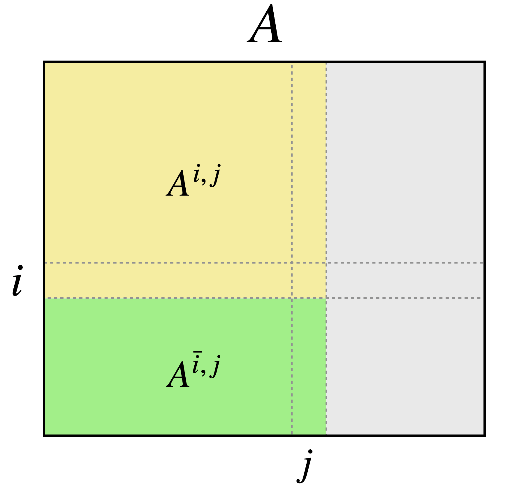

<!-- marp pbsig.md --html --allow-local-files -w -->

<!-- Global style -->

## Persistent Betti Numbers *over time*
### Theory, computation, and applications

---

# Persistent Homology is an _intrinsic invariant_

- Persistent Homology (PH) is a well-established tool in the sciences[1,2]
  
- PH has many attractive properties beyond homology:
   

1. _General_ : Any function-equipped poset admits a $\mathrm{dgm}$ _via rank functions_ [5,6]
2. _Descriptive_ : $d_{B}(\mathrm{dgm}_p(X), \mathrm{dgm}_p(Y))$ lower-bounds $d_{GH}(X, Y)$[7]
3. _Geometric_ :  distributed $\mathrm{dgm}$'s interpolate local geometry $\leftrightarrow$ global topology[4]
4. _Stable_ : $d_B(\mathrm{dgm}(f), \mathrm{dgm}(g)) \leq \lVert f - g \rVert_\infty$ between function $f,g$[3]

<!-- Indeed, the $\mathrm{PH}$-transform is _injective_ on the space of simplicial complexes embedded in $\mathbb{R}^d$ -->
_Collections_ of $\mathrm{dgm}$'s <u>uniquely</u> characterize simplicial complexes in $\mathbb{R}^d$[7]

$$ 
\fbox{
  { \large $\mathrm{PH}$ is more then just a homology inference tool! }
}
$$

<footer class="fixed float-bottom bottom-0 whitespace-nowrap" style="font-size: 0.60rem; line-height: 0.65rem;"> 

1. Wigner, Eugene P. "The unreasonable effectiveness of mathematics in the natural sciences." Mathematics and Science. 1990. 291-306.

2. Turkeš, Renata, Guido Montúfar, and Nina Otter. "On the effectiveness of persistent homology." arXiv preprint arXiv:2206.10551 (2022). 
   
3. Cohen-Steiner, David, Herbert Edelsbrunner, and John Harer. "Stability of persistence diagrams." Discrete & computational geometry 37.1 (2007): 103-120.
   
4. Solomon, Elchanan, Alexander Wagner, and Paul Bendich. "From geometry to topology: Inverse theorems for distributed persistence." arXiv preprint arXiv:2101.12288 (2021).
  
5. Zomorodian, Afra, and Gunnar Carlsson. "Computing persistent homology." Discrete & Computational Geometry 33.2 (2005): 249-274.

6. Bergomi, Mattia G., and Pietro Vertechi. "Rank-based persistence." arXiv preprint arXiv:1905.09151 (2019).
   
7. Turner, Katharine, Sayan Mukherjee, and Doug M. Boyer. "Persistent homology transform for modeling shapes and surfaces." Information and Inference: A Journal of the IMA 3.4 (2014): 310-344.
 
   
</footer>

--- 

# Persistent Homology is a intrinsic _difficult invariant_

The persistence computation scales $\sim O(m^3)$ over $K$ with $m = \lvert K \rvert$ simplices

Morozov gave an counter-example[1] showing this bound to be tight (i.e. $\Omega(m^3)$)

$$ \implies \text{computing } \mathrm{dgm}_p(K) \sim \Theta(m^3) = \Theta(n^{3(p+2)}) \text{ over an } n \text{-point set,} \text{ for } p \geq 1$$

_Simple algorithm_ $\neq$ _simple implementation_ 

1. Computing $R = \partial V$ is _memory intensive_: $\lvert V \rvert \sim O(n^2)$
2. $K$'s structure affects complexity (e.g. 2-manifolds $\sim O(n \alpha(n))$[2])
3. Theory is extensive: _clearing_[3], _apparent pairs_[4], _cohomology_[5], ...
4. $\mathbb{F}$ matters: $\mathbb{Z}_2$ columns $\leftrightarrow$ 64-arity bit-trees w/ cached DeBruijin "magic" tables[6]

 

__Q__: Can we leverage PH theory w/o computing $\mathrm{dgm}$'s? 

<footer class="fixed float-bottom bottom-0 whitespace-nowrap" style="font-size: 0.60rem; line-height: 0.65rem;"> 

1. Morozov, Dmitriy. "Persistence algorithm takes cubic time in worst case." BioGeometry News, Dept. Comput. Sci., Duke Univ 2 (2005).

2. Dey, Tamal Krishna, and Yusu Wang. Computational topology for data analysis. Cambridge University Press, 2022.
  
3. Chen, Chao, and Michael Kerber. "Persistent homology computation with a twist." Proceedings 27th European workshop on computational geometry. Vol. 11. 2011.

4. Bauer, Ulrich. "Ripser: efficient computation of Vietoris–Rips persistence barcodes." Journal of Applied and Computational Topology 5.3 (2021): 391-423.

5. De Silva, Vin, Dmitriy Morozov, and Mikael Vejdemo-Johansson. "Dualities in persistent (co) homology." Inverse Problems 27.12 (2011): 124003.

6. See PHAT's source: https://github.com/blazs/phat/blob/master/include/phat/representations/bit_tree_pivot_column.h
   
</footer>

---

# This Talk: Persistent Betti numbers _over time_ 

The persistent Betti number is a "weaker" invariant than persistent homology 

$$ \beta_p^{i,j}: K_\bullet \to \mathbb{Z}_{+} = \mathrm{dim}(H_p(K_i) \to H_p(K_j)) $$

<!-- The persistence diagram is _defined_ by it's persistent Betti numbers -->

<!-- Thus, time-varying extensions to $\beta_{p}^{i,j}$ $\approx$ properties $\mathrm{dgm}_p$ over time -->

_Betti curves_ are integer-valued functions over a fixed filtration + index set $I$ (say $\mathbb{R}$)

$$ \beta_p: K_\bullet \times \mathbb{R} \to \mathbb{Z}_{+} \quad \Leftrightarrow \quad  \beta_p(\epsilon) \in \mathbb{Z}_+ $$

_Time-varying setting_ $\implies$ 1-parameter families of _Betti_ curves over a set $X$

$$ \beta_p: \mathcal{P}(X) \times \mathbb{R} \times \mathbb{R} \to \mathbb{Z}_{+}  \quad \Leftrightarrow \quad \beta_p(\epsilon, t) \in \mathbb{Z}_+$$

In this talk, we will focus on _persistent Betti curves_ for _fixed_ $i,j \in I$:

$$ \beta_p^{i,j}: \mathcal{P}(X) \times \mathbb{R} \to \mathbb{Z}_{+}  \quad \Leftrightarrow \quad  \beta_p^{i,j}(t) \in \mathbb{Z}_+$$

---

# Outline 

- Background 
  - Simplicial Complexes + Filtrations 
- Deriving a relaxation
  - Looking at $\beta_p^{i,j}$'s definition
  - A Clever Trick
  - Revisiting chains in $\mathbb{R}$ 
  - The relaxation and its properties 
- Applications
  - Computation + $(1+\epsilon)$-approximation
  - "Signatures" of time-varying systems
  - Leveraging PHT theory
---
# Preliminaries

A _simplicial complex_ $K = \{\sigma : \sigma \in \mathcal{P}(V)\}$ over set $V = \{v_1, \dots, v_n\}$ satisfies: 

$$ \text{(vertex)} \quad v \in V \Longrightarrow \{v\} \in K $$
$$ \text{(face)  }  \quad \tau \subseteq \sigma \in K \Longrightarrow \tau \in K $$

All homology computations here will be with _finite simplicial complexes_

--- 

# Boundaries 

Given an _oriented_ $p$-simplex $\sigma \in K$, define its $p$-boundary as the alternating sum:

$$ \partial_p(\sigma) = \partial_p([v_0, v_1, \dots, v_p]) = \sum_{i=0}^p (-1)^i [v_0, \dots, \hat{v}_i, \dots v_p] $$

We will make heavy use of _boundary matrices_

---

# The Groups  

Given a pair $(\, K, \, \mathbb{F} \, )$, a $p$-chain is a formal $\mathbb{F}$-linear combination of $p$-simplices of $K$ 

$$ c = \sum_{i=1}^{m_p} \alpha_i \sigma_i , \quad c + c' = \sum_{i=1}^{m_p} (\alpha_i + \alpha_i') \sigma_i $$

The operator $\partial_p$ extends linearly to $p$-chains via their constitutive simplices 

&nbsp; $C_p(K) = (\, K \, , \, + \, , \, \times \,, \, \mathbb{F} \,)$ 

&nbsp; $B_p(K) = (\mathrm{Im} \circ \partial_{p+1})(K)$ 

&nbsp; $Z_p(K) = (\mathrm{Ker} \circ \partial_{p})(K)$ 

&nbsp; $H_p(K) = Z_p(K) / B_{p}(K)$

&nbsp; &nbsp; $\Longleftrightarrow$

&nbsp; &nbsp; $\Longleftrightarrow$

&nbsp; &nbsp; $\Longleftrightarrow$

&nbsp; &nbsp; $\Longleftrightarrow$

_vector space_ of $p$-chains

_boundary group_

_cycle group_

_homology group_

<!-- _footer: Eades, Peter. "A heuristic for graph drawing." Congressus numerantium 42 (1984): 149-160. -->

---

# Homology 

The $p$-th homology of $K$ is the quotient group $H_p(K) = Z_p(K) / B_{p}(K)$

$\beta_p = \mathrm{dim}(H_p(K)) \leftrightarrow$ the dimension of the $p$-th homology group

<!-- Note: $H_p(K)$ depends on the choice of $\mathbb{F}$ ! -->

---

# Filtrations

A _filtration_ $K_\bullet$ is a family $\{ \, K_i \, \}_{i\in I}$  indexed over a totally ordered index set $I$:

*Filtered* 

*Essential* 

*Simplexwise*
   

&nbsp;&nbsp; $\Longleftrightarrow$

&nbsp;&nbsp; $\Longleftrightarrow$

&nbsp;&nbsp; $\Longleftrightarrow$

 

$K_0 \subsetneq K_1 \subsetneq \dots \subsetneq K_m = K_\bullet$

$i \neq j$ implies $K_i \neq K_j$

$K_j \smallsetminus K_i = \{\sigma_j\}$ when $j = \mathrm{succ}(i)$

 

Any $K_\bullet \mapsto$ essential & simplexwise via _condensing_ + _refining_ + _reindexing maps_ [1]

 

Note here that $I$ may be $\mathbb{R}_+$ or $[m] = \{\, 1, 2, \dots, m\, \}$, depending on the context!

<!-- _footer: Bauer, Ulrich. "Ripser: efficient computation of Vietoris–Rips persistence barcodes." Journal of Applied and Computational Topology 5.3 (2021): 391-423. -->

--- 

# Persistent Homology 

Inclusions $K_i \subsetneq K_j$ induce linear transformations $h_p^{i,j}$ between homology groups 

$$ H_p(K_0) \to \dots \to H_p(K_i) \underbrace{\to \dots \to}_{h_p^{i,j}} H_p(K_j) \to \dots \to H_p(K_m) = H_p(K_\bullet) $$

Important facts and jargon: 
  1. $H_p(K_\bullet)$ admits a _pair decomposition_ $\mathrm{dgm}(K) \subseteq \bar{\mathbb{R}}^2$
  2. $\mathrm{dgm}(K)$ is _unique_ iff $\mathbb{F}$ is a field
  3. $\beta_p^{i,j}$ can be read-off directly for any $i,j$ from $\mathrm{dgm}_p(K)$
  4. Computed via matrix decomposition $R = \partial V$

For simplicity, we will use $\partial_p^i = \partial_p(K_i)$, $Z_p^i = Z_p(K^i)$, $B_p^i = B_p(K^i)$, etc.

<!-- 3. $(\sigma_i, \sigma_j)$ = birth/death pair, $\lvert i - j \rvert$ = persistence of the pair  -->
<!-- Computation: 
  1. Collect the boundary chains of $K$ into a $m \times m$ matrix $\partial$
  2. Compute a specific decomposition $R = \partial V$ using left-to-right column operations -->
<!-- https://iuricichf.github.io/ICT/index.html -->

---

# Outline 

- Background 
  - Simplicial Complexes + Filtrations 
- Deriving a relaxation
  - Looking at $\beta_p^{i,j}$'s definition
  - A Clever Trick
  - Revisiting chains in $\mathbb{R}$ 
  - The relaxation and its properties 
- Applications
  - Computation + $(1+\epsilon)$-approximation
  - "Signatures" of time-varying systems
  - Leveraging PHT theory
  
---

# Recalling the definition

Before extending $\beta_p^{i,j}$ to the time-varying setting, first consider its definition:

<!--    -->

$$
\begin{align*}
	\beta_p^{i,j} &= \mathrm{dim}(H_p^{i,j}) \\
  &= \mathrm{dim} \left( Z_p(K_i) / B_p(K_j) \right) \\
	&\underset{(1)}{=} \mathrm{dim} \big( Z_p(K_i) / ( Z_p(K_i) \cap B_p(K_j)) \big) \\
	&\underset{(2)}{=} \mathrm{dim} \left( Z_p(K_i) \right) - \mathrm{dim}\left( Z_p(K_i) \cap B_p(K_j) \right ) \\
  &\underset{(3)}{=} \mathrm{dim} \left( C_p(K_i) \right) - \mathrm{dim} \left( B_{p-1}(K_i) \right) - \mathrm{dim}\left( Z_p(K_i) \cap B_p(K_j) \right )
  % &= \lvert K_i \rvert - \mathrm{rank}(\partial_p(K_i)) - \mathrm{rank}(`` \; \partial_p^{i,j} \; ")
\end{align*}
$$
<!-- $$ \beta_p^{i,j} = \mathrm{dim} \left( C_p(K_i) \right) - \mathrm{dim} \left( B_{p-1}(K_i) \right) - \mathrm{dim}\left( Z_p(K_i) \cap B_p(K_j) \right )   $$ -->
<!-- where $(1)$ is due to $Z_p(K_i) \leq B_p(K_j)$, $(2)$ follows by def. of quotient a space, and $(3)$ by rank-nullity -->

Replacing the groups above with appropriate matrices / constants, we have: 

$$ \beta_p^{i,j} = \lvert K_i^{(p)} \rvert  - \mathrm{rank}(\partial_p^i) - \mathrm{rank}(\partial_p^{i,j})$$

where $\partial_p^{i,j}$ is _some matrix_ whose columns span $Z_p(K_i) \cap B_p(K_j)$...

--- 

# Computing the _persistent_ Betti number $\beta_p^{i,j}$

  

$$
\fbox{
  $\beta_p^{i,j} = \underbrace{\mathrm{dim} \left( C_p(K_i) \right)}_{(1)} - \underbrace{\mathrm{dim} \left( B_{p-1}(K_i) \right)}_{(2)} - \underbrace{\mathrm{dim}\left( Z_p(K_i) \cap B_p(K_j) \right )}_{(3)}$
}
$$

<!-- $(1)$ is # of $p$-simplices in $K_i$ and $(2)$ is given by $\mathrm{rank}( \partial_p(K_i))$ -->
Both $(1)$ are $(2)$ easy to obtain. Computing $(3)$ is more subtle:

   <!-- a. Use PH / reduction algorithm: $\sum_{k=1}^j \textbf{1}(\mathrm{low}_{R_{p+1}}[k] \leq i)$
   b. Use Gaussian elimination to find basis[1]
   c. Use Anderson-Duffin formula[2]: $P_{\mathbf{Z} \cap \mathbf{B}} = 2 P_{\mathbf{Z}}(P_{\mathbf{Z}} + P_{\mathbf{B}})^\dagger P_{\mathbf{B}}$
   d. Use Von-Neumann's theorem[3]: $P_{\mathbf{Z} \cap \mathbf{B}} = \lim\limits_{n\to \infty}\left( P_\mathbf{Z} P_\mathbf{B}\right)^n$
    -->

&nbsp;&nbsp; PH / reduction algorithm

&nbsp;&nbsp; Gaussian elimination[1]

&nbsp;&nbsp; Anderson-Duffin formula[2]

&nbsp;&nbsp; Von-Neumann's theorem[3]
   

$\implies$

$\implies$

$\implies$

$\implies$

&nbsp;  $\sum_{k=1}^j \textbf{1}(\mathrm{low}_{R_{p+1}}[k] \leq i)$
   
&nbsp; ( see Zomorodian & Carlsson [1] )

&nbsp; $P_{\mathbf{Z} \cap \mathbf{B}} = 2 P_{\mathbf{Z}}(P_{\mathbf{Z}} + P_{\mathbf{B}})^\dagger P_{\mathbf{B}}$

&nbsp; $P_{\mathbf{Z} \cap \mathbf{B}} = \lim\limits_{n\to \infty}\left( P_\mathbf{Z} P_\mathbf{B}\right)^n$

Alternative: $\beta_p^{i,j} = \mathrm{null}(\Delta_p^{i,j})$ where $\Delta_p^{i,j}$ is the _persistent Laplacian_ [4] 

_All of these rely on <u>explicit reductions</u> or <u>expensive projectors</u>. Not great!_

<footer class="fixed float-bottom bottom-0 whitespace-nowrap" style="font-size: 0.60rem; line-height: 0.65rem;"> 

1. Zomorodian, Afra, and Gunnar Carlsson. "Computing persistent homology." Discrete & Computational Geometry 33.2 (2005): 249-274. 
   
2. Ben-Israel, A., and A. Charnes. "On the intersections of cones and subspaces." Bulletin of the American Mathematical Society 74.3 (1968): 541-544.
   
3. Neumann, J. Von. "Functional Operators, Vol. II. The Geometry of Orthogonal Spaces. Annals of Math." Studies Nr. 22 Princeton Univ. Press (1950).
  
4. Mémoli, Facundo, Zhengchao Wan, and Yusu Wang. "Persistent Laplacians: Properties, algorithms and implications." SIAM Journal on Mathematics of Data Science 4.2 (2022): 858-884.
   

</footer>

---

# A clever observation

Given $A \in \mathcal{M}_{(m \times m)}(\mathbb{R})$, let $A^{i,j}$, $A^{\bar{i},j}$ denote the following submatrices of $A$:

Define $r_A(i,j)$ := $\mathrm{rank}(A^{\overline{i-1}, j}) - \mathrm{rank}(A^{\bar{i}, j}) + \mathrm{rank}(A^{\bar{i}, j-1}) - \mathrm{rank}(A^{\overline{i-1}, j-1})$

Let $R = \partial V$ be the boundary matrix decomposition. The following can be shown[2]:

$$ \mathrm{low}_R[j] = i \iff r_R(i,j) \neq 0 \iff r_\partial(i,j) \neq 0 \iff \mathrm{rank}(R^{\overline{i},j}) = \mathrm{rank}(\partial^{\overline{i}, j}) $$

$$
\fbox {
  $\implies$ $\mathrm{rank}(R^{\bar{i},j})$ can be deduced from $\mathrm{rank}(\partial^{\bar{i}, j})$, for any $1 \leq i < j < m$
}$$

This was exploited in first ouput-sensitive persistence algorithm[1,2] 

<footer class="fixed float-bottom bottom-0 whitespace-nowrap" style="font-size: 0.60rem; line-height: 0.65rem;"> 

1. Chen, Chao, and Michael Kerber. "An output-sensitive algorithm for persistent homology." Computational Geometry 46.4 (2013): 435-447.

2. Dey, Tamal Krishna, and Yusu Wang. Computational topology for data analysis. Cambridge University Press, 2022.
   

</footer>

--- 

# A clever trick

Pairing uniqueness $\implies \mathrm{rank}(R^{\bar{i},j}) = \mathrm{rank}(\partial^{\bar{i}, j})$, for any $1 \leq i < j < m$

Dey & Wang show[1] have shown the following:
$$
\begin{align*}
  \mathrm{dim}(Z_p^i \cap B_p^j) &= \mathrm{dim}(B_p^j) - \#(\mathrm{col}_{R_{p+1}}[k] \neq 0 \mid k \in [j], \; \mathrm{low}_{R_{p+1}}[k] > i) \\
  &= \mathrm{rank}(R_{p+1}^{j,j}) - \mathrm{rank}(R_{p+1}^{\overline{i},j}) \\
  &= \mathrm{rank}(\partial_{p+1}^{j,j}) - \mathrm{rank}(\partial_{p+1}^{\overline{i},j})
\end{align*}
$$
Let $I_p^{i}$ be the diagonal matrix with whose first $i$ entries are $1$. We can now write: 
$$ \beta_p^{i,j} = \mathrm{rank}(\mathrm{I}_p^i) - \mathrm{rank}(\partial_{p}^{i,i}) - \mathrm{rank}(\partial_{p+1}^{j,j}) + \mathrm{rank}(\partial_{p+1}^{\overline{i},j})$$
Thus, we may write $\beta_p^{i,j}$ completely in terms of _unfactored matrices_

---

# Parameterizing elementary $p$-chains 

Suppose we fix $\mathbb{F} = \mathbb{R}$ and replace chain values with _smoothstep_ functions $S_\epsilon(x)$

Moreover, replace $\mathrm{rank}(A)$ with $\Phi_\epsilon(A)$, defined for some fixed $\epsilon > 0$ as:

$$ \Phi_\epsilon(A) = \mathrm{tr}\left[A^T(AA^T + \epsilon I)^{-1}A\right] = \sum\limits_{i}^{n} \frac{\sigma_i^2}{\sigma_i^2 + \epsilon}, \quad \text{where }\sigma_i^2 := \lambda_i(A A^T)$$

<!-- Observe $\Phi_\epsilon(A) \leq \mathrm{rank}(A)$, with equality obtained when $\epsilon = 0$.  -->
$$ 
\fbox{
  Final relaxation: $\quad \hat{\beta}_p^{i,j} = \Phi_\epsilon(\mathrm{I}_p^i) - \Phi_\epsilon(\hat{\partial}_{p}^{i,i}) - \Phi_\epsilon(\hat{\partial}_{p+1}^{j,j}) + \Phi_\epsilon(\hat{\partial}_{p+1}^{\overline{i},j})$
}
$$

--- 
# Properties of $\hat{\beta}_p^{i,j}$

$$ 
\fbox{$\hat{\beta}_p^{i,j} = \Phi_\epsilon(\mathrm{I}_p^i) - \Phi_\epsilon(\hat{\partial}_{p}^{i,i}) - \Phi_\epsilon(\hat{\partial}_{p+1}^{j,j}) + \Phi_\epsilon(\hat{\partial}_{p+1}^{\overline{i},j})$
}
$$

Observe $\Phi_\epsilon(A) \leq \mathrm{rank}(A)$, with equality obtained when $\epsilon = 0$.

--- 

# The relaxation (II)

Consider replacing the elementary chain values as follows:

<!-- boundary replacement -->

---

<!-- $$
\def\arraystretch{1.5}
  \underset{\begin{array}{c|c:c:c|}
     & \phantom{}^{a}_{b} & \phantom{}^{a}_{c} & \phantom{}^{b}_{c} \\
    \hline
    a & {\footnotesize \phantom{+} c(\sigma) } & {\footnotesize \phantom{+} c(\sigma)} &   \\ \hdashline
    b & {\footnotesize -c(\sigma)}             &                                       &  {\footnotesize \phantom{+} c(\sigma)} \\ \hdashline
    c &                                        & {\footnotesize -c(\sigma)}            & {\footnotesize -c(\sigma)} \\ \hline
  \end{array}}{\huge \raisebox{0.25em}{\huge $A$}}
$$ -->

$$
\def\arraystretch{1.1}
\begin{array}{rcl} &
\begin{array}{ccc} \phantom{aa} a\ & \phantom{aa} b\ & \phantom{aa} c\ & \phantom{aa} \end{array} \\ 
\color{black}\begin{matrix}u\\v\\w\end{matrix}\hspace{-1.0em} & 
\begin{bmatrix}
{\footnotesize \phantom{+}c(\sigma)} & {\footnotesize \phantom{+}c(\sigma)}  &                                       &  \\
{\footnotesize -c(\sigma)}           &                                       &  {\footnotesize \phantom{+}c(\sigma)} &  \\
                                     & {\footnotesize -c(\sigma)}            &  {\footnotesize -c(\sigma)}           &  
\end{bmatrix}
\end{array}
$$

---

# Properties of the rank function

The _rank_ of a linear map $\Phi$ is given as the dimension of its image: 
$$ \mathrm{r}(\Phi) = \mathrm{rank}(\Phi) = \mathrm{dim}(\mathrm{Im}(\Phi)) $$ 

When $A, B \in \mathcal{M}_{(n \times n)}(\mathbb{R})$,  the _rank function_ has many convenient properties:

*rank-nullity* 

*subadditive* 

*transposition invariance* 

*orthogonal invariance*

*permutation invariance*
   

&nbsp;&nbsp; $\Longleftrightarrow$

&nbsp;&nbsp; $\Longleftrightarrow$

&nbsp;&nbsp; $\Longleftrightarrow$

&nbsp;&nbsp; $\Longleftrightarrow$

&nbsp;&nbsp; $\Longleftrightarrow$

 

&nbsp; $\mathrm{r}(A) = \lvert A \rvert - \mathrm{null}(A)$

&nbsp; $\mathrm{r}(A + B) \leq \mathrm{r}(A) + \mathrm{r}(B)$

&nbsp; $\mathrm{r}(A) = \mathrm{r}(A^T) = \mathrm{r}(A^T A) = \mathrm{r}(A A^T)$

&nbsp; $\mathrm{r}(A) = \mathrm{r}(QA) = \mathrm{r}(AQ^T)$ &nbsp;&nbsp; $\big(Q$ := orthogonal $\big)$

&nbsp; $\mathrm{r}(A) = \mathrm{r}(P^{-1}A P)$  &nbsp;&nbsp; $\big(P$ := permutation matrix $\big)$

Let's see if we can apply some of these. 

---
